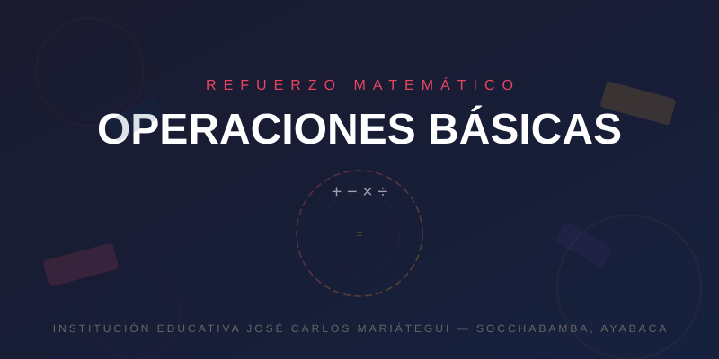

# 📐 Reforzando Operaciones Básicas - IE JOSÉ CARLOS MARIÁTEGUI

<div align="center">



### Plataforma Educativa de Refuerzo Matemático — Nivel Secundaria

</div>

---

## 🏫 Sobre el Proyecto

**"Reforzando Operaciones Básicas"** es una **aplicación web institucional y educativa** desarrollada para la **Institución Educativa José Carlos Mariátegui**, ubicada en **Socchabamba, Ayabaca**. Esta plataforma ha sido diseñada con fines puramente **educativos y pedagógicos**, con el objetivo de fortalecer las habilidades matemáticas de los estudiantes de nivel secundaria mediante la práctica interactiva de las **cuatro operaciones básicas de aritmética**: suma, resta, multiplicación y división.

El proyecto busca convertirse en una herramienta de apoyo didáctico que complemente el proceso de enseñanza-aprendizaje dentro del aula, promoviendo el desarrollo del pensamiento lógico-matemático a través de sesiones de práctica dinámicas y motivadoras.

---

## ✨ Características Principales

- 🎯 **Selección de operaciones**: Los estudiantes pueden elegir entre suma, resta, multiplicación y división para enfocar su práctica.
- ⏱️ **Temporizador integrado**: Sesiones de tiempo limitado que fomentan la velocidad y precisión mental.
- 📊 **Sistema de puntuación**: Lleva un registro detallado de aciertos y errores en tiempo real.
- 📈 **Estadísticas finales**: Al finalizar cada sesión, se muestran los resultados completos incluyendo máximo de aciertos alcanzado.
- 🏅 **Niveles progresivos**: La dificultad aumenta conforme el estudiante avanza y acierta correctamente.
- ✍️ **Identificación de estudiante**: Antes de comenzar, cada alumno ingresa su nombre para personalizar sus resultados.
- 🎨 **Interfaz moderna y atractiva**: Diseño visual con animaciones, partículas y efectos geométricos que hacen del aprendizaje una experiencia engaging.
- 📱 **Diseño responsivo**: Adaptable a diferentes tamaños de pantalla.

---

## 🎓 Propósito Institucional y Educativo

Esta plataforma es un recurso **100% institucional y educativo**, creado exclusivamente para el beneficio de la comunidad estudiantil de la **Institución Educativa José Carlos Mariátegui**. Su propósito fundamental es:

1. **Complementar la enseñanza en el aula**: Ofrecer un espacio de práctica adicional que refuerce los contenidos vistos en clase.
2. **Fomentar la autonomía del estudiante**: Permitir que cada alumno practique a su propio ritmo y nivel.
3. **Desarrollar habilidades cognitivas**: Mejorar la fluidez aritmética, la memoria de trabajo y la capacidad de resolución de problemas.
4. **Hacer visible el progreso**: Las estadísticas permiten a estudiantes y docentes identificar áreas de mejora.
5. **Motivar el aprendizaje**: El formato lúdico y competitivo de la plataforma estimula la participación activa y el interés por las matemáticas.

> ⚠️ **Nota**: Este sitio web fue desarrollado con fines educativos y pedagógicos exclusivamente. No tiene ningún carácter comercial ni lucrativo.

---

## 🛠️ Tecnologías Utilizadas

| Tecnología | Descripción |
|---|---|
| **HTML5** | Estructura semántica de la aplicación web |
| **CSS3** | Estilos, animaciones y diseño visual |
| **JavaScript** | Lógica del juego, temporizador y manejo de puntuaciones |
| **Google Fonts** | Tipografías modernas (Inter, Outfit, Space Grotesk) |
| **SVG** | Gráficos vectoriales para la imagen de encabezado |

---

## 📁 Estructura del Proyecto

```
WEB REFUERZO/
│
├── index.html                      # Archivo principal de la aplicación
├── public/
│   ├── css/
│   │   └── styles.css              # Estilos generales y animaciones
│   ├── js/
│   │   └── script.js               # Lógica del juego y funcionalidades
│   ├── img/
│   │   ├── insignia.png            # Insignia institucional de la IE José Carlos Mariátegui
│   │   ├── ChatGPT Image 20 jul 2026, 09_29_41 a.m..png  # Imagen de referencia
│   │   └── math-banner.svg         # Banner matemático para el README
│   └── assets/                     # Recursos adicionales
├── assets/                         # Directorio de assets
└── README.md                       # Este archivo
```

---

## 🚀 Instrucciones de Uso

1. **Abre el archivo `index.html`** en tu navegador web.
2. **Ingresa tu nombre** en el modal de bienvenida y haz clic en **"Comenzar Reto"**.
3. **Selecciona las operaciones** con las que deseas practicar (suma, resta, multiplicación, división).
4. **Resuelve los problemas** que aparecen en pantalla antes de que se agote el tiempo.
5. **Revisa tus estadísticas** al finalizar la sesión y vuelve a jugar para mejorar tu puntaje.

### Controles:
- **Tecla `Esc`**: Volver a la pantalla principal desde cualquier momento.
- **Botones de respuesta**: Haz clic en la opción correcta.

---

## 👥 Autores y Créditos

- **Institución Educativa José Carlos Mariátegui** — Socchabamba, Ayabaca
- **Proyecto**: Plataforma de Refuerzo de Operaciones Básicas
- **Nivel**: Secundaria
- **Año**: © 2026

---

## 📄 Licencia

Este proyecto es de **uso institucional y educativo**. Todos los derechos reservados por la **Institución Educativa José Carlos Mariátegui**. Queda prohibido su uso comercial sin autorización expresa de la institución.

---

## 🤝 Contribuciones

Las sugerencias y mejoras son bienvenidas siempre y cuando se mantenga el **propósito educativo** del proyecto. Para cualquier consulta o colaboración, contactar a la comunidad docente de la institución.

---

<p align="center">
  <sub>Desarrollado con 💛 para la educación de Socchabamba, Ayabaca — <strong>Institución Educativa José Carlos Mariátegui</strong></sub>
</p>
